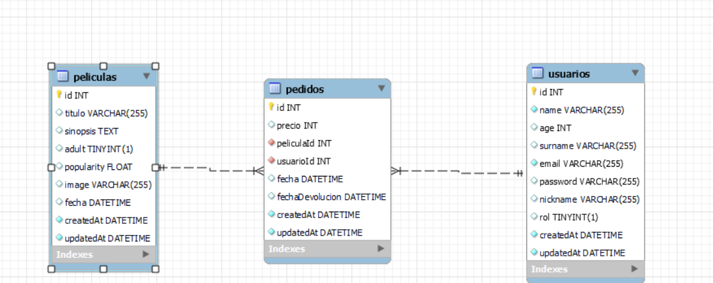

# Proyecto Videoclub API.

### Proyecto realizado para GeeksHubs Academy, en el que se solicita realizar la API de un videoclub con reparto de películas a domicilio.

Nos indican que el proyecto constará de 3 tablas: películas, usuarios y pedidos. Esta seria las tablas relacionadas entre si.

## config

- npm init
- npm install
- npm update
- npm run dev

## Tecnologías utilizadas en el proyecto:

- express
- nodemon
- morgan
- winston
- cors
- jsonwebtoken
- bcrypt

## End-Points:

- Usuarios:

GET http://localhost:3000/usuarios (obtener usuarios)

POST http://localhost:3000/usuarios (registrar usuario)

POST http://localhost:3000/usuarios/login (logear usuario)

DELETE http://localhost:3000/usuarios (eliminar usuarios)

- Peliculas:

GET http://localhost:3000/peliculas (obtener todas)

GET http://localhost:3000/peliculas/titulo?criterio= (buscar por titulo)

GET http://localhost:3000/peliculas/id/ (buscar por id)

- Pedidos:

POST http://localhost:3000/pedidos (añadir nuevo)
